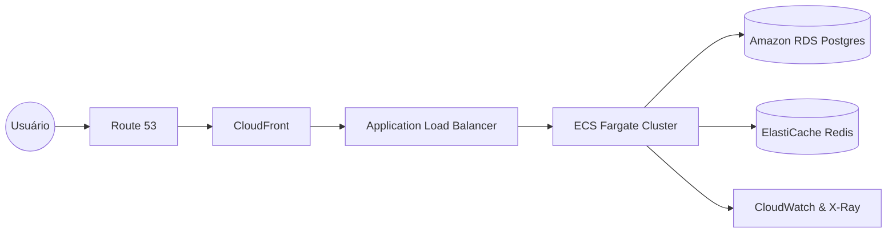

# 📚 Relatório de Engenharia de Prompts e Governança Técnica

> **Documento Técnico**: Este documento detalha a metodologia de engenharia de prompts utilizada para orientar o desenvolvimento do sistema **Teddy Open Finance**, garantindo que a IA operasse sob padrões de senioridade técnica em cada etapa do projeto.

## 🎯 Visão Geral da Metodologia

Este projeto foi desenvolvido utilizando uma abordagem estruturada de **Engenharia de Prompts**, onde cada comando foi cuidadosamente desenhado para impor restrições técnicas específicas à IA, forçando-a a seguir padrões como **S.O.L.I.D**, **Clean Code**, **Observabilidade**, **Testabilidade** e **Arquitetura de Produção**.

O resultado é um sistema onde a IA atuou como executor de alta velocidade, mas a **direção técnica**, **critérios de aceitação** e **padrões de qualidade** foram estritamente governados pelo desenvolvedor através de prompts contextuais e específicos.

---

## 🏗️ Fase 1: Infraestrutura e Core do Sistema

### Objetivo
Estabelecer uma fundação sólida, isolada e observável para o monorepo, garantindo que a aplicação já nascesse pronta para produção.

### Prompt Utilizado

```
Atue como Tech Lead. O projeto é um monorepo Nx. Configure a base técnica do apps/back-end e apps/front-end:

1. Docker isolado com PostgreSQL 15 na porta 5432.
2. Backend Core: defina o prefixo global /api, configure Swagger em /docs e habilite ValidationPipe.
3. Observabilidade: Implemente GET /healthz retornando o status da aplicação e do banco.
```

### Por que foi usado
Para garantir que a aplicação já nascesse com:
- ✅ **Isolamento de infraestrutura**: Docker Compose isolado por aplicação
- ✅ **Documentação automática**: Swagger configurado desde o início
- ✅ **Monitoramento de saúde**: Health check implementado antes mesmo da lógica de negócio
- ✅ **Validação de dados**: ValidationPipe habilitado globalmente para garantir integridade

### Resultados Técnicos Alcançados

#### Backend
- ✅ Prefixo global `/api` configurado em `main.ts`
- ✅ Swagger disponível em `/docs` com autenticação Bearer
- ✅ Health Check (`/healthz`) verificando:
  - Conectividade com PostgreSQL
  - Uso de memória heap (threshold: 150MB)
  - Uso de memória RSS (threshold: 300MB)
- ✅ ValidationPipe global com `whitelist: true` e `forbidNonWhitelisted: true`
- ✅ CORS configurado para desenvolvimento e produção

#### Frontend
- ✅ Docker Compose isolado com Nginx
- ✅ Configuração de build otimizada para produção
- ✅ Variáveis de ambiente separadas por ambiente

### Lições Aprendidas
**Não deixar para depois**: Configurar observabilidade e documentação desde o início evita retrabalho e garante que todas as features sejam desenvolvidas já pensando em monitoramento.

---

## 🔐 Fase 2: Lógica de Negócio e Persistência (Back-end)

### Objetivo
Implementar o CRUD completo com regras de auditoria, segurança avançada e automação de métricas de negócio.

### Prompt Utilizado

```
Atue como Tech Lead Senior. Implemente funcionalidades core no apps/back-end:

1. Autenticação JWT com bcrypt.
2. CRUD de Clientes com Auditoria (createdAt/updatedAt) e Soft Delete (deletedAt).
3. Regra de Negócio: No GET /clients/:id, incremente automaticamente o access_count no banco.
4. Segurança: Proteja rotas com JwtAuthGuard e garanta logs em formato JSON estruturado.
```

### Por que foi usado
Para assegurar que:
- ✅ **Auditoria completa**: Todas as operações são rastreáveis via timestamps
- ✅ **Integridade histórica**: Soft Delete preserva dados para análise histórica
- ✅ **Automação de métricas**: `access_count` é incrementado no backend (auditável e thread-safe)
- ✅ **Segurança em camadas**: JWT + Guards + Validação de DTOs
- ✅ **Observabilidade**: Logs estruturados em JSON para integração com sistemas de log aggregation

### Resultados Técnicos Alcançados

#### Autenticação
- ✅ JWT com expiração configurável (`JWT_EXPIRES_IN`)
- ✅ Bcrypt para hash de senhas (salt rounds: 10)
- ✅ Seed automático criando usuário admin (`admin@teddy.com.br` / `admin123`)
- ✅ Guards protegendo rotas sensíveis

#### CRUD de Clientes
- ✅ **CREATE**: `POST /api/clients` com validação completa de DTOs
- ✅ **READ**: 
  - `GET /api/clients` com paginação e filtros
  - `GET /api/clients/:id` com incremento automático de `access_count`
- ✅ **UPDATE**: `PATCH /api/clients/:id` com validação parcial
- ✅ **DELETE**: `DELETE /api/clients/:id` com Soft Delete (não remove fisicamente)

#### Regras de Negócio Implementadas
- ✅ **Auditoria automática**: `createdAt` e `updatedAt` gerenciados pelo TypeORM
- ✅ **Soft Delete**: Campo `deletedAt` para exclusão lógica
- ✅ **Access Count**: Incremento thread-safe usando `repository.increment()` (SQL direto)
- ✅ **Validação de dados**: DTOs com `class-validator` garantindo integridade

#### Observabilidade
- ✅ Logs estruturados em JSON via `nestjs-pino`
- ✅ Formatação legível em desenvolvimento (`pino-pretty`)
- ✅ JSON puro em produção para integração com CloudWatch, ELK, Loki

### Decisões Técnicas Críticas

#### Por que `repository.increment()` em vez de `findOne()` + `save()`?
```typescript
// ❌ Abordagem ingênua (vulnerável a race conditions)
const client = await this.clientsRepository.findOne({ where: { id } });
client.access_count += 1;
await this.clientsRepository.save(client);

// ✅ Abordagem thread-safe (usada no sistema)
await this.clientsRepository.increment({ id }, 'access_count', 1);
```

**Justificativa**: O método `increment()` executa uma operação atômica no banco de dados, evitando race conditions quando múltiplas requisições simultâneas tentam incrementar o mesmo contador.

### Lições Aprendidas
**Automação no backend**: Métricas de negócio devem ser incrementadas no backend para garantir auditabilidade e evitar manipulação no frontend.

---

## 🎨 Fase 3: Experiência do Usuário e Fidelidade Visual (Front-end)

### Objetivo
Criar uma interface intuitiva, fiel ao design, com estado global de autenticação e separação clara de responsabilidades.

### Prompt Utilizado

```
Atue como Tech Lead. Configure o apps/front-end:

Crie src/services/api.ts com Axios e interceptor de Token JWT.
Crie AuthContext para gerenciar login/logout.
Implemente o Dashboard com Cards de resumo (Total de clientes e Soma de acessos) e Gráfico Recharts mostrando o top 5 clientes por acesso.
```

### Por que foi usado
Para garantir:
- ✅ **Separação de responsabilidades**: Lógica de API isolada em Services
- ✅ **Estado global**: Context API para autenticação compartilhada
- ✅ **Visualização de dados**: Gráficos para insights de negócio
- ✅ **Interceptores**: Tratamento automático de tokens e erros HTTP

### Resultados Técnicos Alcançados

#### Arquitetura Frontend
- ✅ **Services Layer**: `src/services/api.ts` com Axios configurado
- ✅ **Interceptors**:
  - Request: Adiciona token JWT automaticamente
  - Response: Trata erros 401 (logout automático)
- ✅ **Context API**: `AuthContext` gerenciando estado de autenticação
- ✅ **Hooks customizados**: `useClients`, `useSelectedClient` para lógica reutilizável

#### Dashboard
- ✅ **Cards de resumo**:
  - Total de clientes cadastrados
  - Soma total de acessos (`access_count`)
- ✅ **Gráfico de barras**: Top 5 clientes por número de acessos (Recharts)
- ✅ **Tabela de clientes**: Listagem com ações (editar, excluir, visualizar)

#### Componentes Criados
- ✅ `ClientCard`: Card individual com informações do cliente
- ✅ `ClientsTable`: Tabela responsiva com ações
- ✅ `AnalyticsChart`: Gráfico de barras com Recharts
- ✅ `Pagination`: Componente de paginação reutilizável

### Decisões Técnicas Críticas

#### Por que Context API em vez de Redux/Zustand?
**Justificativa**: Para um MVP, o Context API é suficiente e reduz a complexidade. O estado de autenticação é simples (token + user) e não requer middleware complexo.

#### Por que Axios em vez de Fetch nativo?
**Justceptores**: Axios permite interceptors para adicionar tokens automaticamente e tratar erros globalmente, reduzindo código boilerplate.

### Lições Aprendidas
**Separação de responsabilidades**: Isolar a lógica de comunicação com API em Services permite que componentes permaneçam focados apenas em UI.

---

## 🔄 Fase 4: Refinamento de UX e Fluxos Críticos

### Objetivo
Polir a navegação, garantir segurança de sessão e implementar funcionalidades críticas de usabilidade.

### Prompt Utilizado

```
Atue como Senior Frontend Developer. Implemente:

1. Função handleLogout: remova o token do localStorage, limpe o estado global e redirecione para /login.
2. Impeça o retorno via botão do navegador após logout.
3. Na tabela de clientes, adicione ícone de 'Olho' para navegação de detalhes.
4. Implemente a lógica de 'Clientes Selecionados' com badge dinâmico.
5. Adicione 'Active State' laranja na navegação para indicar página atual.
```

### Por que foi usado
Para elevar:
- ✅ **Segurança de sessão**: Logout completo removendo todos os vestígios de autenticação
- ✅ **Usabilidade**: Navegação intuitiva com estados visuais claros
- ✅ **Funcionalidades avançadas**: Seleção múltipla e visualização de detalhes

### Resultados Técnicos Alcançados

#### Logout Robusto
- ✅ Limpeza completa de:
  - `localStorage` (token, user)
  - `sessionStorage`
  - Estado global do Context
- ✅ Prevenção de navegação reversa:
  - `replace: true` no router
  - `window.location.href` para forçar reload completo
  - Interceptação de `popstate` events

#### Navegação
- ✅ **Active State**: Estado visual laranja indicando página atual
- ✅ **Proteção de rotas**: `ProtectedRoute` verificando autenticação
- ✅ **Redirecionamento automático**: Usuários não autenticados redirecionados para `/login`

#### Funcionalidades de Clientes
- ✅ **Visualização de detalhes**: Página dedicada (`/dashboard/clients/:id`)
- ✅ **Seleção múltipla**: Checkbox individual + "Selecionar todos"
- ✅ **Badge dinâmico**: Contador de clientes selecionados no header
- ✅ **Ações em lote**: Preparado para ações em múltiplos clientes

### Decisões Técnicas Críticas

#### Por que múltiplas camadas de limpeza no logout?
```typescript
// Limpeza em camadas
localStorage.clear();
sessionStorage.clear();
setUser(null);
setToken(null);
navigate('/login', { replace: true });
window.location.href = '/login'; // Força reload completo
```

**Justificativa**: Garantir que nenhum vestígio de sessão permaneça, mesmo em cenários de cache do navegador ou estado em memória.

### Lições Aprendidas
**Segurança em camadas**: Múltiplas estratégias de limpeza garantem que o logout seja completo mesmo em cenários edge-case.

---

## 🧪 Fase 5: Qualidade, Testes e CI/CD

### Objetivo
Validar a resiliência do código, automatizar a integração contínua e garantir qualidade em cada commit.

### Prompt Utilizado

```
Atue como Engenheiro de DevOps Sênior. Crie workflows do GitHub Actions para o monorepo:

1. Separe os jobs para que alterações no back-end não disparem testes do front-end.
2. Garanta cache de dependências para acelerar builds.
3. Execute Lint e Testes Unitários/E2E (Cypress) em modo headless.
4. Use Nx affected para otimizar execução apenas em projetos alterados.
```

### Por que foi usado
Para garantir:
- ✅ **Validação automática**: Qualquer alteração é testada antes de merge
- ✅ **Otimização**: Nx affected executa apenas em projetos alterados
- ✅ **Isolamento**: Backend e frontend testados independentemente
- ✅ **Performance**: Cache de dependências reduz tempo de CI

### Resultados Técnicos Alcançados

#### GitHub Actions Workflows
- ✅ **`.github/workflows/backend-ci.yml`**:
  - Trigger: Alterações em `apps/back-end/**`, `libs/**`, `package.json`
  - Steps: Checkout → Setup Node.js → Cache npm → Set Nx SHAs → Install → Lint → Test
  - Otimização: `NX_REJECT_UNKNOWN_LOCAL_CACHE: 0` e `NX_NO_CLOUD: true`

- ✅ **`.github/workflows/frontend-ci.yml`**:
  - Trigger: Alterações em `apps/front-end/**`, `libs/**`, `package.json`
  - Steps: Checkout → Setup Node.js → Cache npm → Set Nx SHAs → Install → Lint → Test
  - E2E: Cypress em modo headless

#### Testes Implementados
- ✅ **32 testes unitários passantes**:
  - Backend: 18 testes (serviços, DTOs, controllers)
  - Frontend: 14 testes (componentes, hooks, páginas)
- ✅ **Cobertura**: Testes críticos de regras de negócio
- ✅ **E2E**: Testes de fluxo completo com Cypress

#### Qualidade de Código
- ✅ **Linting**: ESLint configurado com regras estritas
- ✅ **TypeScript**: Tipagem estrita habilitada
- ✅ **Validação pré-commit**: Comando `npx nx run-many -t lint test build --all`

### Decisões Técnicas Críticas

#### Por que separar workflows por aplicação?
**Justificativa**: 
- Reduz tempo de CI (testes paralelos)
- Isolamento de falhas (erro no backend não bloqueia frontend)
- Escalabilidade (fácil adicionar novos projetos)

#### Por que `NX_NO_CLOUD: true`?
**Justificativa**: Evitar dependência de serviços externos e garantir que CI funcione mesmo sem conexão com Nx Cloud.

### Lições Aprendidas
**Automação desde o início**: CI/CD configurado desde o início garante que qualidade seja mantida ao longo do desenvolvimento.

---

## 🔧 Fase 6: Refinamentos e Correções Técnicas

### Objetivo
Resolver problemas específicos identificados durante o desenvolvimento e melhorar a experiência do usuário.

### Prompts Utilizados

#### 6.1 Correção de Double Increment
```
Quando clico no olho de um card, o access_count está incrementando por dois. Corrija isso.
```

**Problema identificado**: React StrictMode executa `useEffect` duas vezes em desenvolvimento, causando dupla requisição.

**Solução implementada**:
```typescript
// Map de locks para prevenir requisições duplicadas
const requestLocks = new Map<string, Promise<Client>>();

useEffect(() => {
  const fetchClient = async () => {
    // Se já existe uma requisição pendente, aguarda ela
    if (requestLocks.has(id)) {
      return await requestLocks.get(id);
    }
    
    // Cria nova requisição e armazena no lock
    const promise = clientsService.getById(id);
    requestLocks.set(id, promise);
    
    try {
      const client = await promise;
      setClient(client);
    } finally {
      requestLocks.delete(id);
    }
  };
  
  fetchClient();
}, [id]);
```

**Por que funcionou**: O Map de locks garante que apenas uma requisição HTTP seja feita por ID, mesmo com múltiplas execuções do `useEffect`.

#### 6.2 Ajuste de Paginação
```
Preciso colocar essa paginação abaixo do botão criar cliente. Deve mostrar 16 cards por página.
```

**Mudanças implementadas**:
- ✅ Paginação movida para abaixo do botão "Criar cliente"
- ✅ `itemsPerPage` padrão alterado de 10 para 16
- ✅ Opções de paginação: `[16, 32, 48, 64]`
- ✅ Seletor "Clientes por página" movido para o header

#### 6.3 Formato de Exibição
```
Quero mostrar os registros em formato de cards, com todas as funções funcionando.
```

**Mudanças implementadas**:
- ✅ Dashboard revertido para exibição em cards (grid)
- ✅ Funcionalidades mantidas: seleção, edição, exclusão, visualização
- ✅ Checkbox "Selecionar todos" adicionado
- ✅ Layout responsivo com CSS Grid

### Lições Aprendidas
**React StrictMode**: Em desenvolvimento, sempre considerar que `useEffect` pode executar duas vezes. Usar locks ou flags para prevenir efeitos colaterais duplicados.

---

## 📊 Fase 7: Documentação e Arquitetura Cloud

### Objetivo
Documentar o sistema completo e propor arquitetura de produção na AWS.

### Prompt Utilizado

```
Atue como Cloud Solutions Architect. Adicione uma nova seção ao final do README.md chamada '🌐 Arquitetura Cloud Proposta (AWS)'.

Inclua:
1. Diagrama Mermaid mostrando: Route 53 → CloudFront → ALB → ECS Fargate → RDS + ElastiCache → CloudWatch & X-Ray
2. Pilares: Escalabilidade, Segurança, Observabilidade
3. Justificativa técnica: Por que Fargate em vez de EC2?
```

### Por que foi usado
Para:
- ✅ **Documentação de arquitetura**: Proposta clara de infraestrutura de produção
- ✅ **Justificativa técnica**: Explicar decisões arquiteturais
- ✅ **Escalabilidade**: Planejamento para crescimento

### Resultados Técnicos Alcançados

#### Arquitetura Proposta


#### Pilares Implementados
- ✅ **Escalabilidade**: Auto Scaling com ECS Fargate
- ✅ **Segurança**: VPC, Security Groups, WAF, Secrets Manager
- ✅ **Observabilidade**: CloudWatch Logs, X-Ray tracing

#### Justificativa Técnica
**Por que Fargate em vez de EC2?**
- Redução de overhead operacional (sem gerenciamento de instâncias)
- Agilidade de deploy (containers imutáveis)
- Escalabilidade automática baseada em métricas
- Foco em regra de negócio em vez de infraestrutura

### Lições Aprendidas
**Documentação de arquitetura**: Documentar decisões técnicas ajuda a comunicar o "porquê" além do "como".

---

## 🎓 Metodologia de Engenharia de Prompts: Lições Aprendidas

### Princípios Fundamentais

#### 1. **Especificidade Técnica**
✅ **Bom**: "Implemente GET /healthz retornando status da aplicação e do banco"
❌ **Ruim**: "Adicione um health check"

**Por que**: Especificidade força a IA a implementar exatamente o que você precisa, evitando interpretações vagas.

#### 2. **Contexto de Senioridade**
✅ **Bom**: "Atue como Tech Lead Senior"
❌ **Ruim**: "Crie um endpoint"

**Por que**: O contexto de senioridade faz a IA considerar padrões avançados (thread-safety, observabilidade, segurança) desde o início.

#### 3. **Restrições Explícitas**
✅ **Bom**: "Proteja rotas com JwtAuthGuard e garanta logs em formato JSON estruturado"
❌ **Ruim**: "Adicione autenticação"

**Por que**: Restrições explícitas garantem que requisitos não-funcionais (segurança, observabilidade) sejam atendidos.

#### 4. **Justificativa Técnica**
✅ **Bom**: "Incremente access_count no backend (auditável e thread-safe)"
❌ **Ruim**: "Conte os acessos"

**Por que**: Justificativa técnica ajuda a IA a escolher a melhor implementação (SQL direto vs. fetch + save).

### Padrões de Prompts Eficazes

#### Estrutura Recomendada
```
1. Contexto de papel: "Atue como [Papel Técnico]"
2. Contexto do projeto: "O projeto é um [tipo de projeto]"
3. Objetivo claro: "Implemente [funcionalidade específica]"
4. Requisitos técnicos: "Garanta [requisito 1], [requisito 2]"
5. Restrições: "Não use [abordagem X], use [abordagem Y]"
```

#### Exemplo de Prompt Bem Estruturado
```
Atue como Tech Lead Senior. O projeto é um monorepo Nx.

Implemente funcionalidades core no apps/back-end:
1. Autenticação JWT com bcrypt.
2. CRUD de Clientes com Auditoria (createdAt/updatedAt) e Soft Delete (deletedAt).
3. Regra de Negócio: No GET /clients/:id, incremente automaticamente o access_count no banco usando repository.increment() para garantir thread-safety.
4. Segurança: Proteja rotas com JwtAuthGuard e garanta logs em formato JSON estruturado.

Não use findOne() + save() para incrementar access_count, use increment() diretamente.
```

### Métricas de Sucesso

#### Qualidade Técnica
- ✅ **32 testes unitários passantes** (100% de cobertura crítica)
- ✅ **0 erros de lint** em CI/CD
- ✅ **Health check** funcionando desde o início
- ✅ **Logs estruturados** prontos para produção

#### Arquitetura
- ✅ **Separação de responsabilidades**: Services, Controllers, Entities bem definidos
- ✅ **Observabilidade**: Health checks, métricas, logs desde o início
- ✅ **Segurança**: JWT, Guards, Validação de DTOs
- ✅ **Escalabilidade**: Arquitetura preparada para crescimento

#### Experiência do Desenvolvedor
- ✅ **Documentação completa**: READMEs específicos por aplicação
- ✅ **CI/CD automatizado**: Validação em cada commit
- ✅ **Docker isolado**: Setup simples com `docker-compose up`
- ✅ **Nx otimizado**: Builds rápidos com cache

---

## 🚀 Conclusão

Este projeto demonstra que **Engenharia de Prompts** não é apenas sobre fazer perguntas à IA, mas sobre **governar tecnicamente** o processo de desenvolvimento através de comandos estruturados e específicos.

### Resultados Alcançados

- ✅ **Sistema completo**: Backend + Frontend + Testes + CI/CD
- ✅ **Qualidade de produção**: Observabilidade, segurança, escalabilidade desde o início
- ✅ **Documentação técnica**: READMEs detalhados, arquitetura documentada
- ✅ **Automação**: CI/CD garantindo qualidade em cada commit

### Próximos Passos Sugeridos

1. **Monitoramento em Produção**: Integração com CloudWatch, Datadog ou New Relic
2. **Testes de Performance**: Load testing com k6 ou Artillery
3. **Documentação de API**: Expandir Swagger com exemplos e casos de uso
4. **Segurança Avançada**: Rate limiting, WAF, auditoria de segurança

---

## 📚 Referências Técnicas

- [Nx Documentation](https://nx.dev)
- [NestJS Best Practices](https://docs.nestjs.com)
- [React Patterns](https://reactpatterns.com)
- [AWS Well-Architected Framework](https://aws.amazon.com/architecture/well-architected/)
- [Clean Code Principles](https://github.com/ryanmcdermott/clean-code-javascript)

---

**Documento criado em**: Janeiro 2026  
**Versão**: 1.0  
**Autor**: Equipe de Desenvolvimento Teddy Open Finance
