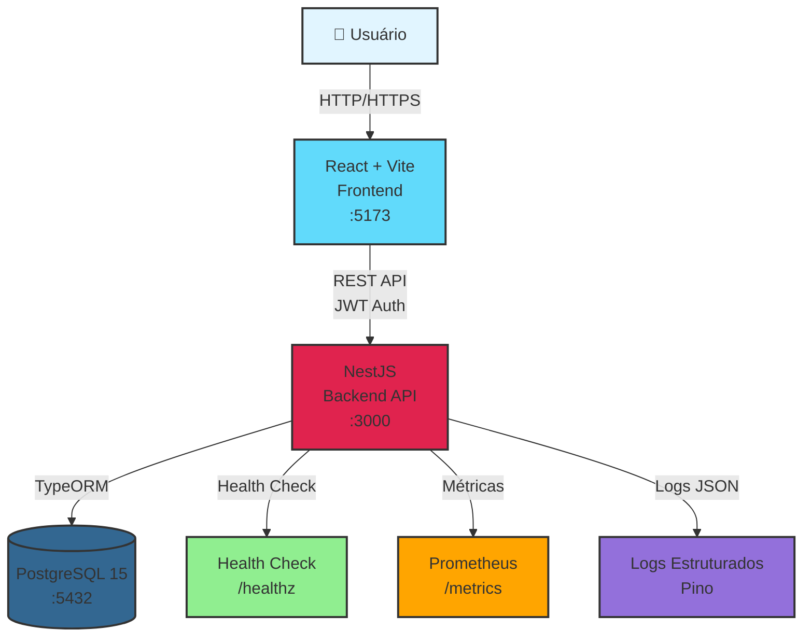
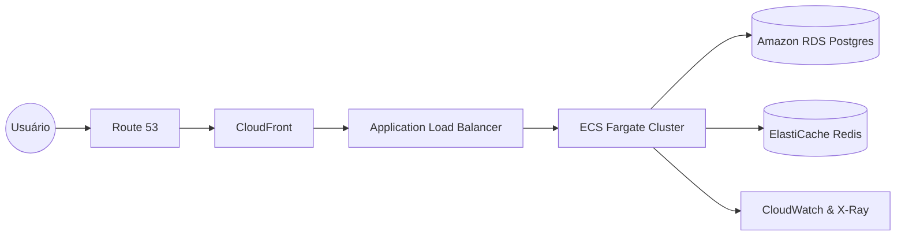

# Teddy Open Finance

Monorepo Nx para a plataforma Teddy Open Finance - Sistema de gestão financeira com arquitetura moderna e observabilidade completa.

## 📋 Visão Geral

Este projeto é um monorepo gerenciado pelo **Nx** que contém:

- **Backend** (`apps/back-end`): API REST desenvolvida com NestJS, TypeORM e PostgreSQL
- **Frontend** (`apps/front-end`): Aplicação React desenvolvida com Vite
- **Bibliotecas compartilhadas** (`libs/`): Código reutilizável entre aplicações

### 🎯 Diferenciais Técnicos

- ✅ **32 testes unitários passantes** cobrindo backend e frontend
- ✅ **Health Check** (`/healthz`) com verificação de banco de dados e memória
- ✅ **Observabilidade completa**: Logs estruturados em JSON, métricas Prometheus
- ✅ **Arquitetura profissional**: Separação clara de responsabilidades, Docker isolado por app
- ✅ **Documentação técnica**: README específico para cada aplicação

## 🏗️ Arquitetura do Sistema



### Fluxo de Dados

1. **Usuário** acessa a aplicação React no navegador
2. **Frontend** faz requisições HTTP para o backend com autenticação JWT
3. **Backend** processa requisições, valida dados e acessa o banco via TypeORM
4. **PostgreSQL** armazena dados de forma persistente
5. **Observabilidade** coleta logs, métricas e health checks para monitoramento

## 🚀 Como Subir os Ambientes

### Pré-requisitos

- Node.js v20+ (recomendado LTS)
- Docker e Docker Compose instalados
- npm ou yarn instalado

### Instalação Inicial

```bash
# 1. Instalar todas as dependências
npm install

# 2. Os arquivos .env já estão criados em cada app
# Se necessário, ajuste as variáveis em:
# - apps/back-end/.env
# - apps/front-end/.env
```

### 🐳 Opção 1: Docker Compose (Recomendado - Mais Simples)

#### Backend (PostgreSQL + API)

```bash
# 1. Navegar para o diretório do backend
cd apps/back-end

# 2. Subir os serviços (PostgreSQL + Backend)
docker-compose up -d

# 3. Verificar se está rodando
docker-compose ps

# 4. Ver logs (opcional)
docker-compose logs -f
```

**Acessos Backend:**
- API: http://localhost:3000/api
- Swagger: http://localhost:3000/docs
- Health Check: http://localhost:3000/healthz
- Métricas: http://localhost:3000/metrics

#### Frontend (Nginx)

```bash
# 1. Navegar para o diretório do frontend
cd apps/front-end

# 2. Subir o serviço
docker-compose up -d

# 3. Verificar se está rodando
docker-compose ps
```

**Acesso Frontend:**
- Frontend: http://localhost:80 (ou porta configurada no `.env`)

#### Parar os Serviços Docker

```bash
# Backend
cd apps/back-end
docker-compose down

# Frontend
cd apps/front-end
docker-compose down
```

---

### 💻 Opção 2: Desenvolvimento Local (Sem Docker para Apps)

#### Passo 1: Subir o Banco de Dados (Docker)

```bash
# Apenas o PostgreSQL via Docker
cd apps/back-end
docker-compose up -d postgres

# Verificar se está rodando
docker-compose ps
```

#### Passo 2: Subir o Backend

Em um terminal:

```bash
# Na raiz do projeto
npx nx serve back-end
```

O backend estará disponível em: http://localhost:3000/api

#### Passo 3: Subir o Frontend

Em outro terminal:

```bash
# Na raiz do projeto
npx nx serve front-end
```

O frontend estará disponível em: http://localhost:5173

---

### 🎯 Opção 3: Usando Nx Run-Many (Tudo Junto)

Subir Backend e Frontend em Paralelo:

```bash
# 1. Subir apenas o banco de dados
cd apps/back-end
docker-compose up -d postgres
cd ../..

# 2. Subir backend e frontend juntos
npx nx run-many --target=serve --projects=back-end,front-end --parallel=2
```

Isso iniciará ambos os serviços simultaneamente.

---

### ✅ Verificar se Está Funcionando

#### Backend

```bash
# Health Check
curl http://localhost:3000/healthz

# Deve retornar:
# {"status":"ok","info":{...},"timestamp":"...","uptime":...}
```

#### Frontend

Abra no navegador: http://localhost:5173 (dev) ou http://localhost:80 (Docker)

---

## 🔐 Credenciais de Acesso (MVP)

Para facilitar a avaliação, o banco de dados é iniciado automaticamente com um usuário administrador:

- **Usuário:** admin@teddy.com.br
- **Senha:** admin123

> **Nota:** Estas credenciais são geradas via script de Seed no primeiro carregamento da aplicação.

---

### 🔧 Troubleshooting

#### Erro: Porta já em uso

**Backend:**
```bash
# Altere a porta no apps/back-end/.env
PORT=3001
```

**Frontend:**
```bash
# Altere a porta no apps/front-end/.env
FRONTEND_PORT=8080
```

#### Erro: Banco de dados não conecta

```bash
# Verificar se o PostgreSQL está rodando
cd apps/back-end
docker-compose ps

# Ver logs do PostgreSQL
docker-compose logs postgres

# Reiniciar o banco
docker-compose restart postgres
```

#### Erro: Dependências não instaladas

```bash
# Na raiz do projeto
npm install
```

#### Limpar tudo e recomeçar

```bash
# Parar todos os containers
cd apps/back-end
docker-compose down -v  # Remove volumes também

cd ../front-end
docker-compose down

# Reinstalar dependências
cd ../..
npm install
```

---

### 📝 Resumo Rápido

#### Docker (Mais Simples)

```bash
# Terminal 1 - Backend
cd apps/back-end
docker-compose up -d

# Terminal 2 - Frontend
cd apps/front-end
docker-compose up -d
```

#### Desenvolvimento Local

```bash
# Terminal 1 - Banco
cd apps/back-end
docker-compose up -d postgres
cd ../..

# Terminal 2 - Backend
npx npx nx serve back-end

# Terminal 3 - Frontend
npx npx nx serve front-end
```

#### Tudo Junto (Nx)

```bash
# Terminal 1 - Banco
cd apps/back-end
docker-compose up -d postgres
cd ../..

# Terminal 2 - Backend + Frontend
npx npx nx run-many --target=serve --projects=back-end,front-end --parallel=2
```

---

### 🌐 URLs de Acesso

| Serviço | URL | Descrição |
|---------|-----|-----------|
| Frontend (Dev) | http://localhost:5173 | Aplicação React |
| Frontend (Docker) | http://localhost:80 | Aplicação React via Nginx |
| Backend API | http://localhost:3000/api | API REST |
| Swagger | http://localhost:3000/docs | Documentação da API |
| Health Check | http://localhost:3000/healthz | Status da aplicação |
| Métricas | http://localhost:3000/metrics | Métricas Prometheus |

## 📦 Estrutura do Monorepo

```
teddy-open-finance/
├── apps/
│   ├── back-end/          # API NestJS
│   │   ├── docker-compose.yml  # PostgreSQL + Backend
│   │   ├── Dockerfile          # Build da aplicação
│   │   ├── .env.example       # Variáveis de ambiente
│   │   └── README.md           # Documentação técnica
│   ├── front-end/         # Aplicação React + Vite
│   │   ├── docker-compose.yml  # Nginx servindo build
│   │   ├── Dockerfile          # Build da aplicação
│   │   ├── nginx.conf          # Configuração Nginx
│   │   ├── .env.example        # Variáveis de ambiente
│   │   └── README.md           # Documentação técnica
│   └── ...
├── libs/                  # Bibliotecas compartilhadas
│   ├── api/               # Clientes de API
│   ├── shared/            # Utilitários compartilhados
│   └── shop/              # Módulos de e-commerce
├── nx.json                # Configuração Nx
├── package.json           # Dependências do workspace
└── README.md              # Este arquivo
```

## 🧪 Testes

### Executar Todos os Testes

```bash
# Executar todos os testes do monorepo
npx nx run-many --target=test --all

# Executar testes de um projeto específico
npx nx test back-end
npx nx test front-end
```

### Cobertura de Testes

O projeto possui **32 testes unitários passantes**:

- **Backend:** 18 testes cobrindo serviços, DTOs e controllers
- **Frontend:** 14 testes cobrindo componentes, hooks e páginas

### Rodar a Verificação Total

Após fazer correções ou alterações no código, execute o comando abaixo para verificar que todos os "checks" estão verdes (lint, testes e build):

```bash
npx nx run-many -t lint test build --all
```

Este comando executa em paralelo:
- ✅ **Lint** - Verifica qualidade e padrões do código
- ✅ **Test** - Executa todos os testes unitários
- ✅ **Build** - Valida que o código compila corretamente

É recomendado executar este comando antes de fazer commit ou abrir um pull request.

## 🔍 Observabilidade

### Health Check (`/healthz`)

Endpoint público que verifica a saúde da aplicação:

```bash
curl http://localhost:3000/healthz
```

**Verificações:**
- ✅ Conectividade com PostgreSQL
- ✅ Uso de memória heap (threshold: 150MB)
- ✅ Uso de memória RSS (threshold: 300MB)

**Resposta quando saudável:**
```json
{
  "status": "ok",
  "info": {
    "database": { "status": "up" },
    "memory_heap": { "status": "up" },
    "memory_rss": { "status": "up" }
  },
  "timestamp": "2024-01-01T12:00:00.000Z",
  "uptime": 3600.5
}
```

### Logs Estruturados (JSON)

Todos os logs são gerados em formato JSON estruturado usando `nestjs-pino`:

- **Desenvolvimento:** Formatados com `pino-pretty` para legibilidade
- **Produção:** JSON puro para integração com sistemas de log aggregation (ELK, Loki, CloudWatch)

**Exemplo de log estruturado:**
```json
{
  "level": 30,
  "time": 1234567890,
  "pid": 12345,
  "req": {
    "id": "req-123",
    "method": "POST",
    "url": "/api/auth/login"
  },
  "res": {
    "statusCode": 200
  },
  "msg": "POST /api/auth/login - 200"
}
```

### Métricas Prometheus (`/metrics`)

Endpoint público que expõe métricas no formato Prometheus:

```bash
curl http://localhost:3000/metrics
```

**Métricas disponíveis:**
- Métricas padrão do Node.js (CPU, memória, event loop lag)
- Métricas HTTP (quando configurado)

**Integração com Prometheus:**
```yaml
# prometheus.yml
scrape_configs:
  - job_name: 'teddy-backend'
    scrape_interval: 15s
    metrics_path: '/metrics'
    static_configs:
      - targets: ['localhost:3000']
```

## 🐳 Docker

Cada aplicação possui seu próprio `docker-compose.yml` isolado:

### Backend

```bash
cd apps/back-end
docker-compose up -d
```

Inicia PostgreSQL + Backend API.

### Frontend

```bash
cd apps/front-end
docker-compose up -d
```

Inicia Nginx servindo o build da aplicação React.

## 📚 Documentação Técnica

Cada aplicação possui sua própria documentação técnica:

- **[Backend README](apps/back-end/README.md)** - Documentação completa da API
- **[Frontend README](apps/front-end/README.md)** - Documentação da aplicação React

## 🛠️ Comandos Nx Úteis

```bash
# Executar aplicações
npx nx serve back-end
npx nx serve front-end

# Build de produção
npx nx build back-end
npx nx build front-end

# Executar testes
npx nx test back-end
npx nx test front-end

# Linting
npx nx lint back-end
npx nx lint front-end

# Executar múltiplos projetos em paralelo
npx npx nx run-many --target=serve --projects=back-end,front-end --parallel=2
npx nx run-many --target=test --all
npx nx run-many --target=build --all --prod
```

## 🔧 Tecnologias Principais

### Backend
- **NestJS** - Framework Node.js progressivo
- **TypeORM** - ORM para TypeScript/JavaScript
- **PostgreSQL** - Banco de dados relacional
- **Swagger** - Documentação da API
- **Terminus** - Health checks
- **nestjs-pino** - Logs estruturados em JSON
- **prom-client** - Métricas Prometheus
- **JWT** - Autenticação baseada em tokens

### Frontend
- **React 19** - Biblioteca JavaScript para interfaces
- **Vite** - Build tool e dev server
- **TypeScript** - Tipagem estática
- **React Router** - Roteamento client-side
- **Axios** - Cliente HTTP
- **Recharts** - Gráficos e visualizações

## 📝 Scripts Disponíveis

```bash
# Instalar dependências
npm install

# Executar testes E2E
npm run test:e2e

# Executar todos os testes
npx nx run-many --target=test --all

# Build de produção de todos os projetos
npx nx run-many --target=build --all --prod
```

## 🤝 Contribuindo

1. Crie uma branch a partir de `main`
2. Faça suas alterações
3. Execute os testes: `npx nx run-many --target=test --all`
4. Submeta um pull request

## 📄 Licença

MIT

---

## 🌐 Arquitetura Cloud Proposta (AWS)

Para levar esta solução ao ambiente de produção seguindo padrões de alta disponibilidade, propomos a seguinte arquitetura na AWS:



### 💎 Pilares da Implementação

- **Escalabilidade**: O uso de **AWS Fargate** permite o escalonamento horizontal automático (Auto Scaling) dos containers de **Backend** e **Frontend** conforme a demanda, sem a necessidade de gerenciar instâncias EC2 ou capacity planning manual. As tasks podem escalar com base em métricas como CPU, memória ou latência.

- **Segurança**:
  - **Isolamento**: Banco de dados em **sub-redes privadas** dentro de uma **VPC**, protegido por **Security Groups** que só permitem tráfego a partir dos serviços ECS.
  - **Edge Protection**: **AWS WAF** acoplado ao **CloudFront** para mitigar ataques como SQL Injection, XSS e tentativas de DDoS na borda.
  - **Secrets**: Armazenamento seguro de credenciais sensíveis (credenciais do RDS, chaves **JWT**, segredos de API) via **AWS Secrets Manager**, evitando exposição em variáveis de ambiente estáticas ou código-fonte.

- **Observabilidade**:
  - **Centralized Logging**: Ingestão dos logs JSON do backend (Pino / nestjs-pino) diretamente em **CloudWatch Logs**, permitindo criação de dashboards, métricas derivadas e alarmes.
  - **Tracing**: Integração com **AWS X-Ray** para rastrear requisições ponta-a-ponta, identificando gargalos entre o serviço **NestJS** e o **PostgreSQL (RDS)**, além de mapear dependências entre serviços.

### 🧠 Justificativa Sênior: Por que Fargate em vez de EC2?

A escolha por **ECS Fargate** em vez de instâncias fixas **EC2** reduz drasticamente o **overhead operacional**: não é necessário gerenciar patching de SO, capacity planning fino ou auto-scaling por instância. Cada service é descrito como um conjunto de containers imutáveis, versionados pela pipeline de CI/CD, o que aumenta a **agilidade de deploy** e rollback. Em um contexto de MVP evoluindo para produção, essa abordagem **container-first** permite crescer de forma previsível, mantendo custos sob controle e liberando o time para focar em regra de negócio em vez de gestão de infraestrutura de baixo nível.

